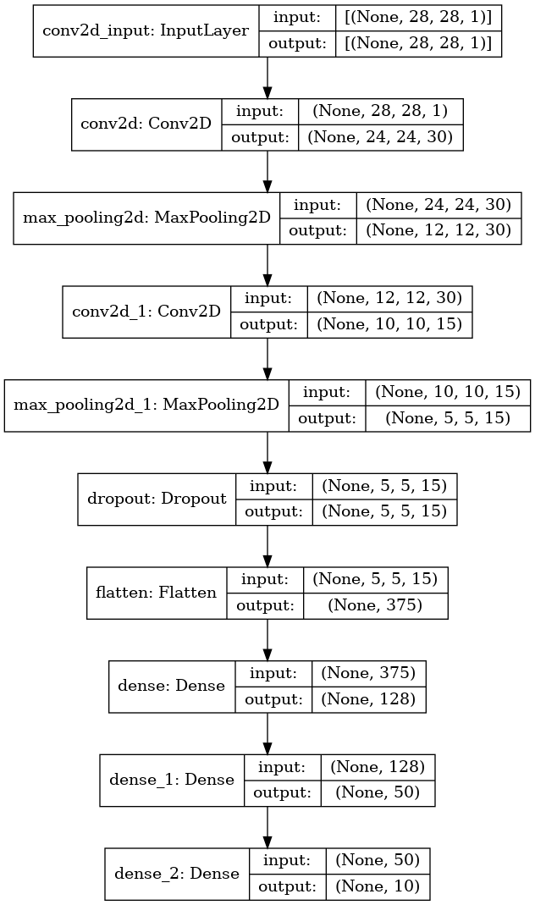
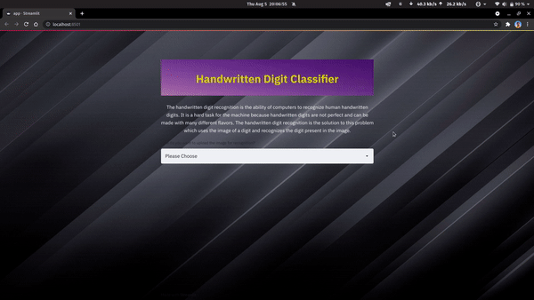

<h1 align="center"> Hand Written Digit Classifier </h1>

This project is a demonstration of the capability of deep learning techniques in object recognition in image data. It is a handwritten digit recognition model using the MNIST dataset.The handwritten digit recognition is the ability of computers to recognize human handwritten digits. It is a hard task for the machine because handwritten digits are not perfect and can be made with many different variations. The handwritten digit recognition is the solution to this problem which uses the image of a digit and recognizes the digit present in the image.

---

## Model Architecture



The model in .h5 format may be downloaded from <a href = "https://drive.google.com/file/d/1iwutxvsbuw48MObnk9wYPhLWUS1Vk9YJ/view?usp=sharing">here</a>.

---

<h2>How to use the web app</h2>

1. Installing the required softwares:-
   ```bash
   pip install -r requirements.txt
   ```
2. Cloning the repository:-
   ```bash
   git clone https://github.com/theAdarshSrivastava/Hand-Wriiten-digit-classifier.git
   ```
3. Run the web app:-
   ```bash
   streamlit run app.py
   ```
4. To close the app from the terminal, press Ctrl+C.

---

<h2>Demo</h2>


